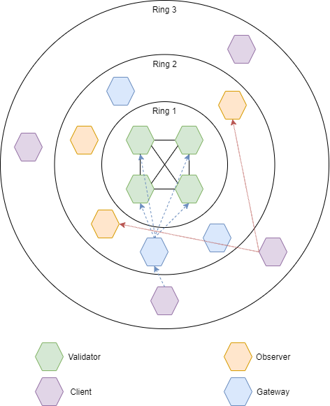
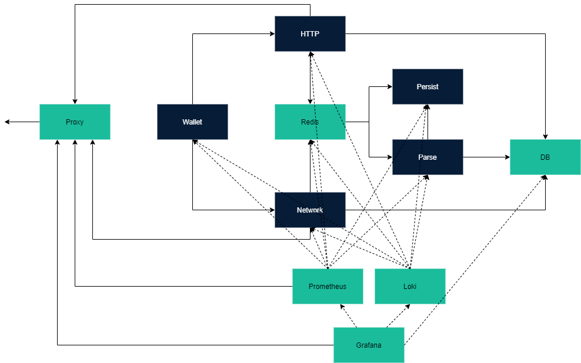

# Architecture

## Rings
The following diagram shows the different node types divided onto three rings.

### Ring 1
Ring 1 contains only the validators, so this is the level where the consensus takes place, and the blockchain is stored. 
The validators are all connected to each other (fully meshed). They only make requests to each other, but take requests 
from ring 2 nodes and respond to those.

### Ring 2
On ring 2 there are the observers and gateways. The observers are only for reading, so they take requests from the 
ring 3 nodes and respond with the corresponding database entry.  
The gateways take requests from the ring 3 nodes and make requests to the ring 1 nodes. They are not read only, but can 
send write transactions to the ring 1 nodes, which decide if the transaction is parsed. 

### Ring 3
Ring 3 contains the clients. They are not directly connected to the blockchain network, which means they don't have a 
version of the blockchain themselves. The clients can make read and write requests via the ring 2 nodes. 

## Microservices
Each node in the network consists of several microservices. The image below shows the microservices of one node. 

The services pictured in dark blue are the trustchain specific services, while the turquoise ones are just tools we are
using. 

### Trustchain specific services

| Service | Description |
| ----------- | ----------- |
|  **HTTP** | Service to communicate externally. | 
|  **Network** | Service to communicate within the blockchain network. | 
|  **Wallet** | Service to handle and manage the keys. |  
|  **Persist** | Service to write transactions to the blockchain. | 
|  **Parse** | Service to write transactions to the database. | 

### Tools 
| Tool | Description |
| ----------- | ----------- |
|  **Proxy** | A used proxy. Usage of a proxy server is optional.| 
|  **Redis** | Redis is an open source, in-memory data structure store, used here to emit and listen to events with services, that are not directy connected. | 
|  **DB** | The database to store the blockchain data.| 
|  **Prometheus** | A monitoring tool to gather numbers and data from the services while running.| 
|  **Loki** | A logging tool.| 
|  **Grafana** |  A graphic tool to show data. In our case that would be the data of Prometheus and Loki.| 

### Transaction processing
The nodes create transactions and send them to the corresponding nodes for processing. They send the transactions to the 
HTTP- or Network-Service depending on the type of connection (http or websocket). The services send the transactions 
to the services depending on the type of transaction. The services validate the transactions and process them. 
