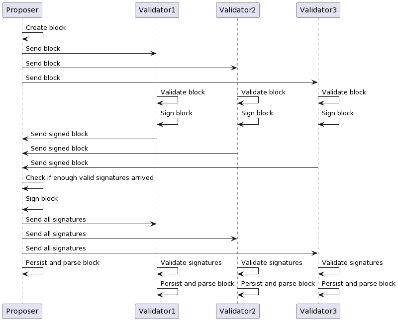
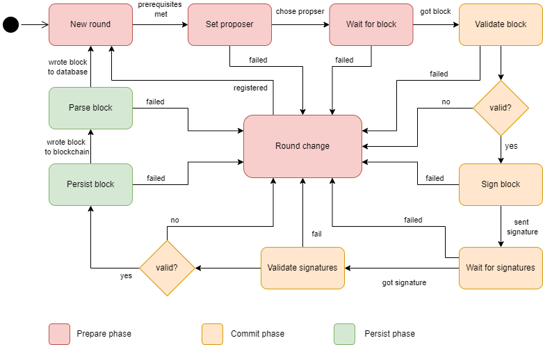
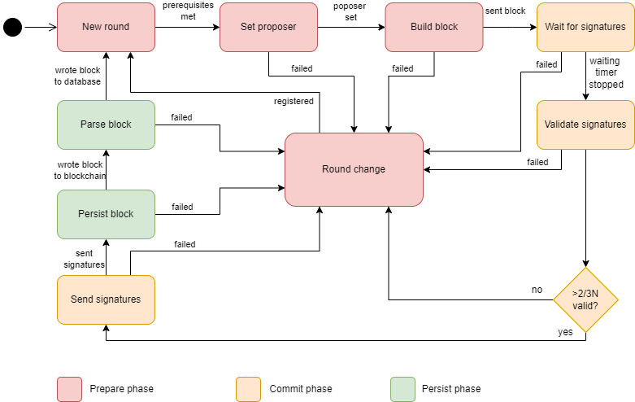

# Consensus protocol

## Summary
The consensus algorithm is the algorithm that describes how the consensus is formed about what content will be included in the blockchain. Here, all participating nodes have equal rights.
There are various consensus algorithms. We use the TBFT (Trusted Byzantine Fault Tolerance), which is very similar to the very well-known PBFT (Practical Byzantine Fault Tolerance), but generates less overhead. This is described in the following chapter.

## Motivation

Distributed systems and distributed computing require a common understanding and coordinating  of a variety of processes and data value that are resistant to tampering and have a fault tolerance. Without it, all network participants lack trust and integrity of data, so it is necessary to agree on a consensus for data processing.

One advantage of distributed ledger technology (DLT) like blockchain is the consensus algorithm. The consensus algorithm allows nodes to agree on the integrity and uniform processing of data on the blockchain, creating a common level of trust among all equal network participants.

## Introduction
There are two different roles for the nodes in the consensus - validator and proposer. There is one proposer each round, and the rest of the nodes are validators. 

The algorithm is round based, each round decides on one block.

The algorithm is a BFT (Byzantine Fault Tolerance) algorithm, so it has the BFT properties. 

## Overview 
This section gives a quick overview to see how the algorithm works.

Each round starts with determining which node is the proposer, because the proposer changes every round. Every node has to choose the same node as proposer for the algorithm to work correctly. After setting the roles, the decision-making can start. 

 

As pictured above the proposer starts with building the block from the transactions in its transaction pool. 
The proposer then sends the built block to all the validators taking part in the consensus. 

Each validator validates the block on its own. If a validator confirms the block, it creates a signature of the block with its private key and sends the signature back to the proposer. 

The proposer validates the received signatures and checks if at least 66% of the validators responded positively. If that's confirmed the proposer signs the block, too, and sends all the signatures to the validators to confirm the block can be added to the blockchain. 

The validators validate all signatures. If all are valid they add the block to the blockchain and the database.
The next round can start. 

## Validator round
 
__New round:__ Before a new round can begin, certain prerequisites must be met. In this phase, these preconditions are checked and fulfilled if possible. 
Firstly, there have to be enough connections for consensus to be reached at all. 
From the BFT properties, the network must consist of at least 3f + 1 nodes (where f is the number of tolerable faulty nodes). The minimum number of nodes min_N is min_N = 3f + 1. Since each node should be connected to every other node, each node must have at least min_N – 1 connections for consensus to start. So, the minimum number of required connections depends on the number of tolerable faulty nodes (f). 
As long as not all prerequisites are fulfilled, the node remains in this state.

__Set Proposer:__ When the network is ready for a new round, the first step is to set a proposer. It must be ensured that all nodes select the same proposer. This can be done in several different ways.

**Wait for block:** When a proposer is found, a validator starts waiting to receive a block from the proposer. So, it listens for a maximum time to the proposer to get a block. If the proposer does not send a block within the given time, there is a timeout. Otherwise, it is possible to proceed to the next step. 

**Validate Block:** When a block is received from the proposer, it can and must be validated. Each node is supposed to give its approval to the block in order to make a decentralized decision, so each node must also check if it agrees with the block. Therefore, validation in each node is necessary.
For this, the received block is validated for syntax and semantics. If the validator approves the block, it proceeds to the next step. If the validator does not find the block to be valid, it proceeds to the round change phase. 

__Sign block:__ For a valid block each validator creates a signature with its key and the proposed block. After creation the validator sends the signature back to the proposer. Therefore, sending a signature equals agreement to the block. 

__Wait for signatures:__ After sending its own signature, the validator waits for the proposer to respond with the bundled signatures of the other validators. 

__Validate signatures:__ When the validator received the signatures it validates them. One invalid signature is enough to change the round, because the node must assume that the proposer has been corrupted otherwise it would not send an invalid signature. If all signatures are valid, the validator will proceed.

__Persist block:__ The round was successful, and the validator writes the block to the blockchain.

__Parse block:__ When the block is in the blockchain, the block is also parsed to the database to grant a faster possibility to access the data. If the parsing succeeded, the validator starts a new round. 

__Round change:__ The node registers that the round was not successful and logs the reason. It also increments the counter for unsuccessful rounds in a row, then starts a new round.

## Proposer round
  
__New round:__ (It’s the same as for the validator, if you’ve read that you can skip this phase here.) Before a new round can begin, certain prerequisites must be met. In this phase, these preconditions are checked and fulfilled if possible. 
Firstly, there have to be enough connections for consensus to be reached at all. 
From the BFT properties, the network must consist of at least 3f + 1 nodes (where f is the number of tolerable faulty nodes). The minimum number of nodes min_N is min_N = 3f + 1. Since each node should be connected to every other node, each node must have at least min_N – 1 connections for consensus to start. So, the minimum number of required connections depends on the number of tolerable faulty nodes (f). 
As long as not all prerequisites are fulfilled, the node remains in this state.

__Set Proposer:__ (It’s the same as for the validator, if you’ve read that you can skip this phase here.)
 When the network is ready for a new round, the first step is to set a proposer. It must be ensured that all nodes  select the same proposer. This can be done in several ways. 
 
__Build block:__ The proposer builds the block from the transactions in its transaction pool and sends it to the validators.

__Wait for signatures:__ After sending the block, the proposer starts a timer. Within this time, it listens on the validators to answer with their signature to agree to the block. 

__Validate signatures:__ When the timer stopped, the proposer checks if there are enough valid responds from the validators. “Enough” means at least 66% (2/3) of the validators must agree (i.e., send a valid signature) 

**Send signatures:** When the proposer received enough valid signatures, it bundles them and sends the bundle to the validators which agreed to the block. 

__Persist block:__ (It’s the same as for the validator, if you’ve read that you can skip this phase here.) The round was successful, and the validator writes the block to the blockchain.

__Parse block:__ (It’s the same as for the validator, if you’ve read that you can skip this phase here.) When the block is in the blockchain, the block is also parsed to the database to grant a faster possibility to access the data. If the parsing succeeded, the validator starts a new round. 

__Round change:__ (It’s the same as for the validator, if you’ve read that you can skip this phase here.) The node registers that the round was not successful and logs the reason. It also increments the counter for unsuccessful rounds in a row, then starts a new round.

## Open Questions
- What are the benefits and drawbacks of our consensus algorithm?
- How to ensure that each node selects the same proposer?
- There is no method implemented yet to remove malicious nodes from the network. What is the best strategy to do this?
- The proposer changes every round. Is this really necessary? What are alternatives or the best strategy?
- What's the real benefit of our consensus algorithm (in numbers)?