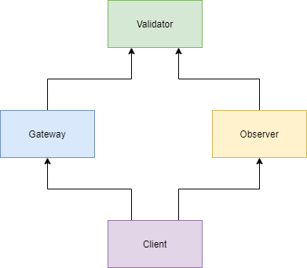

# Nodes
## Node types
* Validator
  * The validators are the nodes that are deciding on the blocks for the blockchain. They are not deciding for themselves but find a consensus together. 
  * Every validator has the blockchain, and a transaction pool. 
* Gateway
  * Gateways are the nodes that grant access to the validators for outsiders. 
  * Every gateway has the blockchain, and a transaction pool.
  * The gateways filter the requests to the blockchain, so they protect the validators by filtering and scaling.
* Observer
  * Observers are the nodes that enable outsiders to read the blockchain by communicating with the validators.
  * The observers do not have a version of the blockchain, or a transaction pool.
  * Observers do not need signatures, so they have no cryptographic demands. They are only for reading so take this 
  responsibility off other nodes to relieve the system. 
* Client
  * Clients are the nodes that serve the users to interact with the blockchain network. 
  * The clients do not have a version of the blockchain, or a transaction pool.

## Hierarchy
  
The hierarchy levels are similar to the ring structure (see chapter [architecture](architecture.md#rings))
* Validator
  * A validator can sign the key of a gateway or an observer so its higher in the hierarchy.
  * The validators decide on the blocks that are added to the blockchain, so they are the most powerful nodes. 
  * Validators are on the highest level in the hierarchy.
* Gateway
  * A gateway can sign the key of a client so its higher in the hierarchy.
* Observer
  * An observer cannot sign any key or create another transaction, it is read only. 
* Client
  * A client is the on the lowest level in the hierarchy, so it does not interact with the validators directly but only with gateways or observers. 

