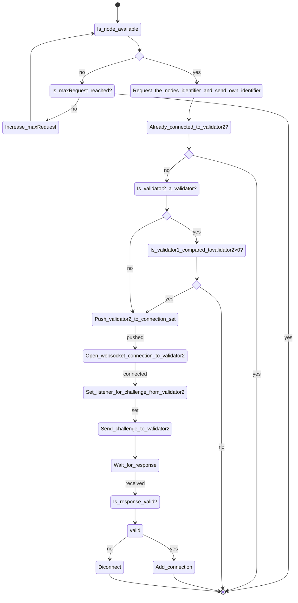
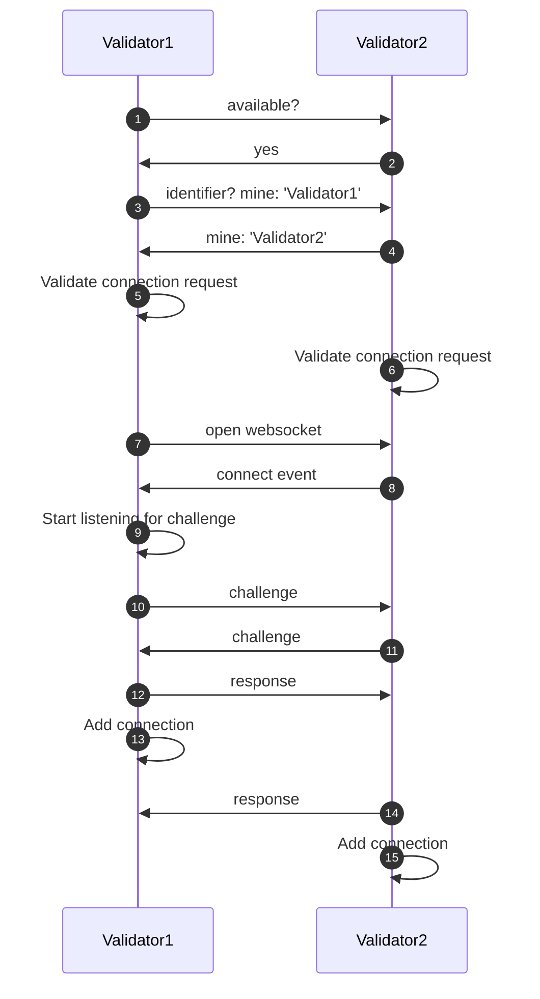

# Peer-to-peer (P2P) protocol

## Summary

The peer-to-peer protocol describes how nodes connect to other nodes. It also defines how new nodes are added to the network or existing nodes are removed from the network.

<!-- Synch von KNoten fehlt noch-->

## Motivation

The blockchain network consists of multiple nodes that communicate with each other. We need to establish a procedure for how the nodes initially connect to each other and how new nodes can be added or existing nodes can be removed once the network is established, and to ensure that all nodes have a consistent view of the network.

## Validator connecting to another validator

### Validators connecting flow

The peer-to-peer (P2P) protocol first checks whether the validator or node to which a connection is to be established is still available. If not, it will be checked if the number of requests has reached the maximum. If the number of request reached the maximum, the connection will be closed, if not the number of the request will be increased by 1 and and it is checked one more time if the node is available.

In case that the targeted node is available the node identifier will be requested and the requesting node will sent it's identifier. As a result the node identifier of the requested node is sent back. 

With the identifier of the requested node a validator can check if a connection to the requested node is already established. If there is already a connection, nothing more needs to be done. 

Otherwise, the next step is to check whether the node to which a connection is to be established is a validator. In case the node is a valid validator it is agreed which node starts the connection establishment by a simple string compare so that only one websocket connection is created and the listeners are set only once. 

If the requested node is not a validator it is pushed to the connection set and a websocket is open to the node and the connection will established. In the next step a listener is set and a challenge is sent to the requested node. Is the response is valid the connection is added, if not the connection will be disconnected. 

## Validators connecting sequence

<!-- In case that the targeted node is available the node identifier will be requested and the node identifier is sent back. -->

## Synchronisation of Data

## Network adding new nodes

## Network removing existing nodes
<!-- How to remove existing nodes from the network-->
<!-- -> in Code gucken oder Mirko fragen-->

## What happens if one node fails

## Security

### Trustanchor
##### Node to node
-Genesis file with list of validators and their respective public keys
##### Client to node

## Open Questions

