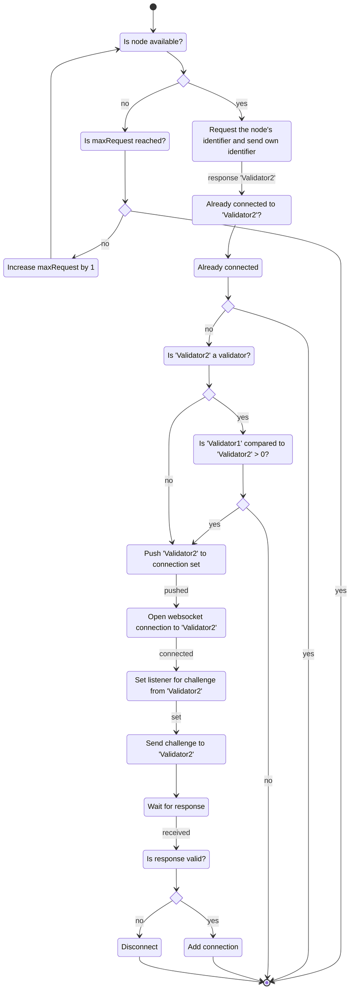
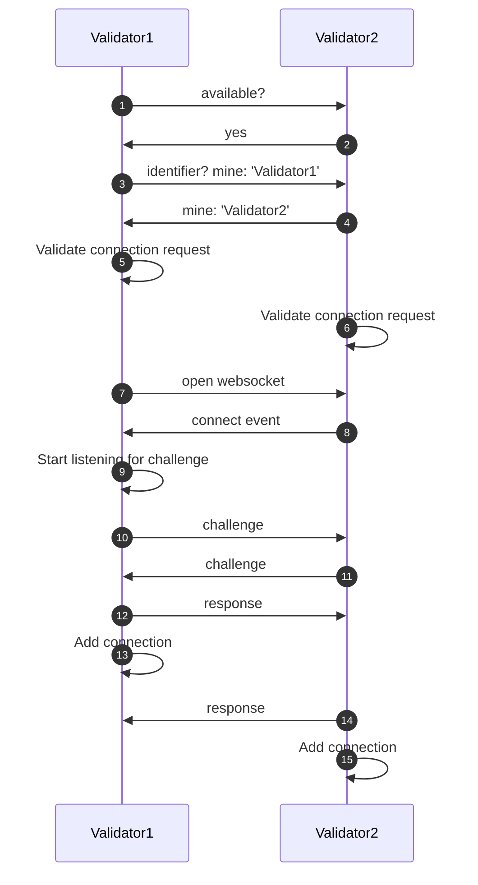

# Peer-to-peer (P2P) protocol

## Summary

The peer-to-peer protocol describes how nodes connect to other nodes. It also defines how new nodes are added to the network or existing nodes are removed from the network.

## Motivation

The blockchain network consists of multiple nodes that communicate with each other. We need to establish a procedure for how the nodes initially connect to each other and how new nodes can be added or existing nodes can be removed once the network is established, and to ensure that all nodes have a consistent view of the network.

## Network-Betrieb

### Validator connecting to another validator

In order to connect to the network, a new validator initially has to connect to one single validator. Once this initial connection is established, the validator sends the new validator the necessary information to connect to the rest of the network.

It is preconfigured to which validator a new validator connects upon start.

#### Validators connecting flow
<!--  -->

The peer-to-peer (P2P) protocol first checks whether the validator or node to which a connection is to be established is still available. If not, it will be checked if the number of requests has reached the maximum. If the number of request reached the maximum, the connection will be closed, if not the number of the request will be increased by 1 and and it is checked one more time if the node is available.

In case that the targeted node is available the node identifier will be requested and the requesting node will sent it's identifier. As a result the node identifier of the requested node is sent back. 

With the identifier of the requested node a validator can check if a connection to the requested node is already established. If there is already a connection, nothing more needs to be done. 

Otherwise, the next step is to check whether the node to which a connection is to be established is a validator. In case the node is a valid validator it is agreed which node starts the connection establishment by a simple string compare so that only one websocket connection is created and the listeners are set only once. 

If the requested node is not a validator it is pushed to the connection set and a websocket is open to the node and the connection will established. In the next step a listener is set and a challenge is sent to the requested node. Is the response is valid the connection is added, if not the connection will be disconnected. 

#### Validators connecting sequence
<!-- 
    
-->

### Synchronization of data

After a new validator node successfully connects to one of the network nodes, it synchronizes the blockchain including the network state. This procedure is described in detail in [catch-up](todo_catchup).

Using the information of the now synchronized network state, the new validator is now able to connect to the rest of the network.

### What happens if one node fails
- consensus braucht Zustimmung von [Formel mit n] nodes
- Network can be configured to tolerate up to n faulty nodes, minimum number of nodes berechnet sich daraus, consensus funktioniert dann entsprechend noch

### What happens if Rolle weg
- was passiert wenn der Status eines node sich ändert (Rolle weg)
    - falls Rolle nicht Liste: Macht es überhaupt Sinn dass es Knoten ohne Rolle gibt?
        - ich glaube, es geht hier aber eher darum, dass Knoten dann z.B. automatisch entfernt werden oder so. Also dass Trigger/Events existieren, die mit solchen und ähnlichen Fällen umgehen (what happens if Rolle dazu? kp)

## Network management

### Adding new nodes

- Before validators connect to each other as described above, they need to be part of the network.
- The network participants are festgehalten in the network state as part of the blockchain
- New participants can be added to the network (state) as follows:
    - [procedure/algorithm beschreiben]
    - Teil der Procedure: Anschließend Genesis-File updaten und neu publishen (?)
<!--
Johnny glaubt, dass das noch nicht existiert:
    - ❓ Bisher musste immer neues Netzwerk aufgezogen werden, wenn ein neuer Knoten dazukommen sollte
-->

<!-- (Notiz aus Call)
- ❓ kann ein node mehrere Rollen einnehmen?
kann ein Knoten mehrere Rollen haben? Role = Liste oder wert?
- ❓ kann ein gateway befördert werden?
-->

### Removing existing nodes
❓
<!-- How to remove existing nodes from the network-->
<!-- in Code gucken oder Mirko fragen -->
<!-- Analog zu Abschnitt "Network adding new nodes" -->
<!-- (Notiz aus Call)
    - von observer und gateways können key entfernt werden (ist im Prinzip wie das Entfernen von Knoten)
-->

### Network upgraden
<!-- z.B. von Version 1.0 auf 1.1 -->

- When updating network, to prevent downtime, network can be updated gradually / rollingly. That way, network is not down all nodes at the same time and easy uptime.

❗ Muss noch implementiert werden
### Update network config
- config
    - update network rules
### Umgang mit Knoten die sich falsch verhalten
- knoten die sich falsch verhalten?
❓❓

## Security

### Trusted network
- Nur trusted nodes sind part of the network, because their public keys are in genesis file and nodes only accept new connections from known nodes form genesis file

- trustanchor? how do i get a valid genesis file. Ist gelöst, einfach von HitGub ziehen, alternativ auch von GubHit

### Resilience against denial of service attacks
- TrustChain defense mechanisms against DoS attacks:
    - ⁉️

### Trustanchor
<!--
❓ Die nutzen doch die gleiche Genesis-File, oder? [DF10112022]
-->
#### Node to node
- Genesis file with list of validators and their respective public keys
#### Client to node

### Broken chain

The risk of a broken chain is possible if the majority of validators lose their private keys at the same time, although the risk is relatively small. The validators would not be able to perform a key rotation because the consensus is not possible due to the missing private keys.

## Open questions

- Describe mechanisms/algorithms how to ensure all nodes have a consistent view of the network (during runtime)

16.11.2022

