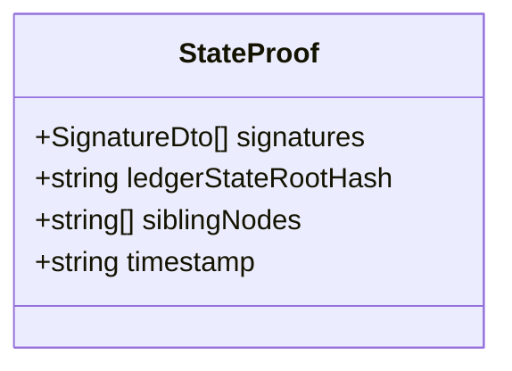
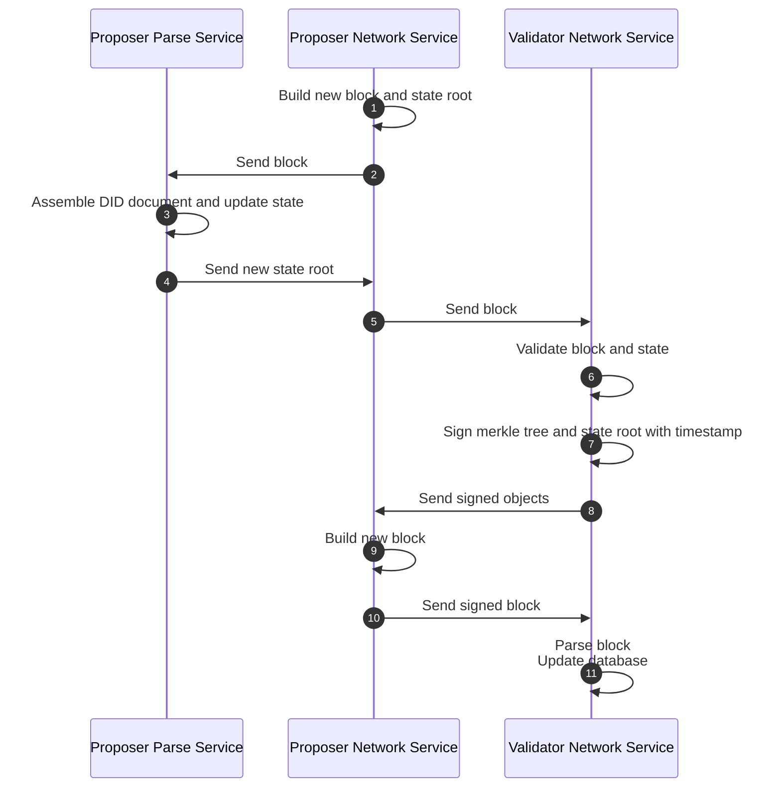
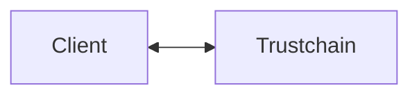
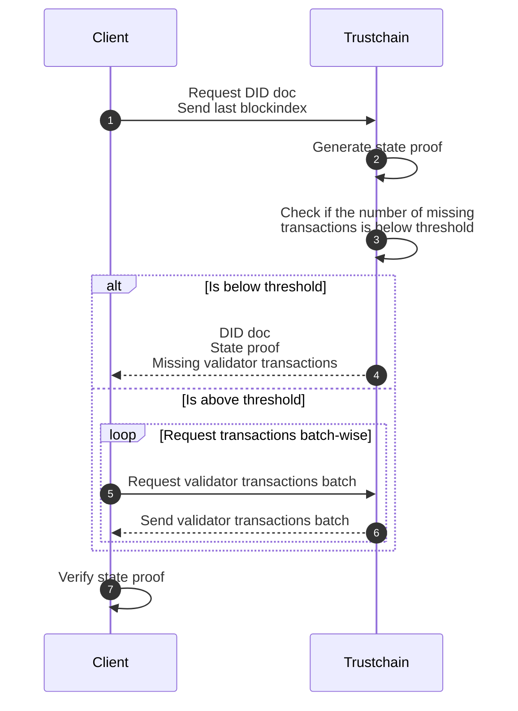
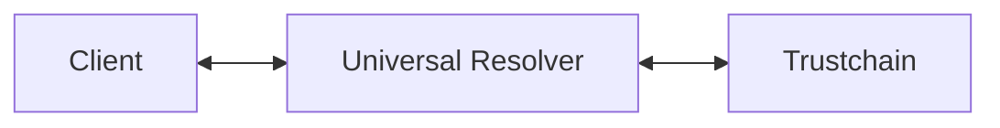
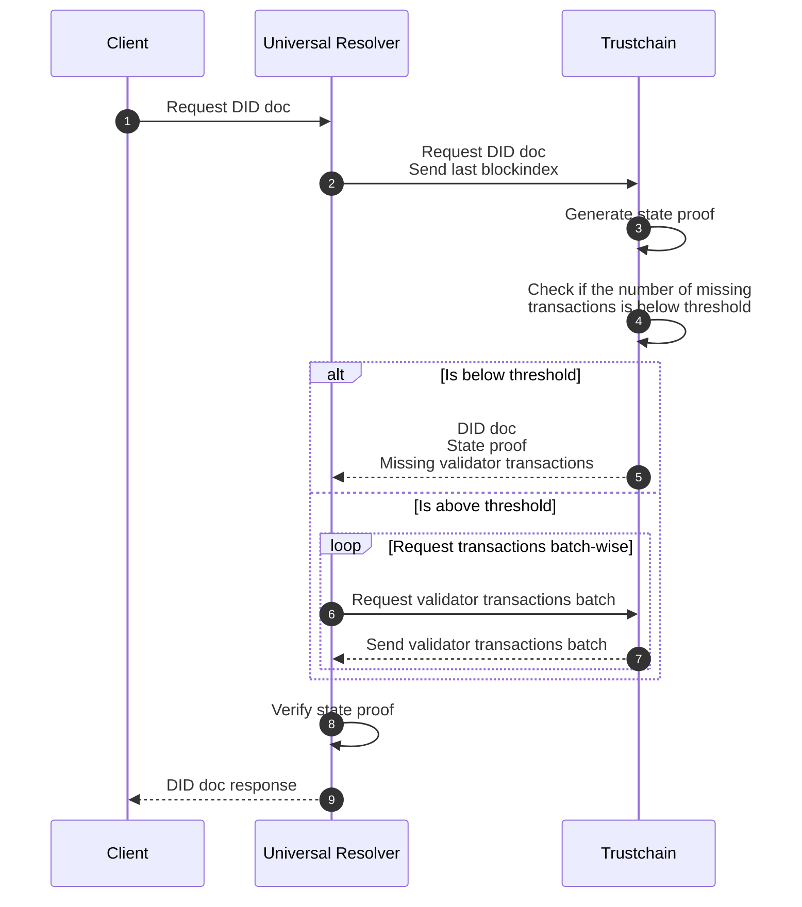

# State Proof

## Summary

The state of the trustchain ledger is stored in a Patricia Merkle trie and represents the state of all parsed DID resources. By signing the state root along with a timestamp by multiple validators, it is possible to verify that a particular DID resource is included in the state trie and is therefore part of the ledger.

The signed state is stored periodically and allows to work with verified previous states of the ledger.


## Motivation

To validate verifiable credentials (VC), the verifier may not need to request the issuer's current DID documents, but rather those at the time the credential was issued, as the issuer's signing keys may have changed over time.

This problem occurs because DID documents are mutable objects that can change their state over time (e.g., due to key rotation). When the object is immutable, it is trivial for the ledger to provide a verifiable response. However, if the object is mutable, there is no trivial way for the ledger to provide a verifiable response of an object's state in the past or to cryptographically guarantee that it provides the latest version of an object.
State proof allows for a mechanism to verifiably link every version of a DID resource to a specific point in time.

Since not all verifiers operate their own observer node that could provide them with the information directly, they must instead rely on external observer nodes to provide them with valid DID documents. State proof is a mechanism that enables trust in the observer's response by cryptographically verifying that the returned DID document was included in the ledger state at the requested time.

One could use the BFT approach to verify the received information, but this approach requires querying multiple observer nodes and lacks cryptographic verification. With state proof, it is sufficient to query only one external observer node, since the returned state proof is signed by all validators of the network at the time.


## Structure of the state proof

The structure of a state proof is similar to an ordinary block header of the trustchain. A client needs the signatures to validate the authenticity of the information sent by the trustchain/node.

Therefore, the state proof consists of the ledger state root hash, a list of all necessary sibling nodes that lead to the root hash, the timestamp of block creation and is signed by the validators. This information can be used to prove that a specific DID document existed at a given time. The timestamp also guarantees the freshness of the state proof.


A state proof consists of following elements:


* signatures:
    * A list of signatures of all validators
* ledgerStateRootHash
    * Which is signed together with a timestamp as part of the block header
* siblingNodes 
    * The hashes of sibling nodes leading to the root hash
* timestamp
    * The timestamp of the creation to prove the freshness
<!--
Example of a state proof:
```
{
    signatures: ["abc...def", "dhi...jkl", "5fa...2ef"],
    ledgerStateRootHash:,
    siblingNodes: [...]
    timestamp: 599616123,
}
```
-->

## Terminology
- State
    - The state of a system at a specific time
- State root
    - The root element of a Merkle tree, which is signed by the validators to be accepted
- State proof
    - A proof that a given element is part of a Merkle Patricia trie whose root has been signed by multiple validators
- Consensus
    - The consensus is the process in which the validator nodes of the network decide about adding a new block to the blockchain, see [consensus](https://trustcerts.github.io/trustchain-doc/#/./concepts/consens)
- Transactions
    - A DID document is assembled by transactions, where each transactions can modify the DID document such as by adding, rotating or removing a key. These transactions are combined in a block and signed during the consensus of the blockchain. Additionally, there is a signed Merkle tree over all transactions on the blockchain.
- Merkle tree
    - A Merkle tree / hash tree is a cryptographic data structure that allows efficient and secure verification of its contents, see [Merkle tree](https://en.wikipedia.org/wiki/Merkle_tree).
- Patricia Merkle Trie
    - A Patricia Merkle Trie provides a cryptographically authenticated data structure that can be used to store all (key, value) bindings, see [Patricia Merkle Trie](https://ethereum.org/en/developers/docs/data-structures-and-encoding/patricia-merkle-trie/).
- BFT approach
    - The [Byzantine fault tolerance](https://en.wikipedia.org/wiki/Byzantine_fault) is used to accomplish resiliency in distributed networks, see [consensus](https://trustcerts.github.io/trustchain-doc/#/./concepts/consens).


## Freshness

State roots are generated at regular intervals (e.g. every 5 minutes) and stored on the ledger. This allows for older state roots to be retrieved for any time in the past, and ensures that the current ledger state always has an up-to-date signature.

For example, a client can verify whether a DID resource that was last changed 2 months ago is still the latest version and has not been changed in the meantime, by verifying that it is part of the latest signed ledger state.

## Evaluation of using block signatures as an insufficient alternative to state proof

All transactions on the ledger are protected by a Merkle tree, whose hash is signed during the consensus of the blockchain and stored as the transaction root hash in the block header. It seems reasonable to use the transaction root hash as a way to verify a requested DID document. However, this method has one drawback compared to the state proof:

* While verifying the validity of a DID document by querying the corresponding transactions from the ledger, this approach lacks the ability of temporal verification. E.g. if there are more/newer transactions on the ledger than those returned by the observer, the verifier has no way of verifying it has received **all** relevant transactions, as the incomplete transactions (sub-)set is still cryptographically valid on its own.


## Handling the state in the nodes

The state root is generated as part of the consensus.

1. After the [proposer](https://trustcerts.github.io/trustchain-doc/#/./concepts/consens) builds a new block, it calculates the new state root. 
2. Then the proposer's [network service](https://trustcerts.github.io/trustchain-doc/#/./concepts/architecture?id=trustchain-specific-services) sends the new block to the [parse service](https://trustcerts.github.io/trustchain-doc/#/./concepts/architecture?id=trustchain-specific-services) (which is handling the state module)
3. If the block contains new transactions that affect DID documents, the parse service assembles the resulting DID documents and updates the state.
4. Then it returns the (new) state root to the network service.
5. The proposer sends the new block to the [validators](https://trustcerts.github.io/trustchain-doc/#/./concepts/nodes?id=node-types).
6. The validators validate the transactions and the new state
7. The validators sign both the Merkle tree of the transactions and the state root, each including the current timestamp
8. The validators return the signed objects to the proposer
9. The proposer puts everything together into a new block
10. The proposer shares the newly built block with the network
11. All nodes (validators, [gateways & observers](https://trustcerts.github.io/trustchain-doc/#/./concepts/nodes?id=node-types)) parse the new block, updating their databases. In case of an empty block, only the state root database is updated, so it contains the newly signed state roots.



## Verification process

The verification process describes how a verifier can validate the authenticity and integrity of a requested DID resource for a specific time using the state proof.  

The verifier also checks the integrity of the currently used public keys of the validators. To achieve this, the client is expected to synchronize the network state as needed: It caches validator transactions, starting from the genesis block (obtained from a trusted source) up to the most recent validator transaction it needs for deriving the correct public keys required for validating the state proof.

The verification process can be done either directly by the client or by an external universal resolver.

### Scenario 1: A client communicates directly with the trustchain

When a client communicates directly with the trustchain, it takes the responsibility for both resolving the DID document as well as verifying the state proof locally.

This process can be described as follows:



1. The verifier sends a request to the trustchain through an observer for a DID resource for a specific time.
    - The request includes the client's latest block index of its cached validator transactions
2. The observer generates the state proof. 
3. The observer checks if the number of missing transactions is below or above a certain threshold (e.g. 8MB).
4. The observer responds with:
    - The generated state proof
    - The assembled DID resource
    - Missing validator transactions
5. (Optional) In case number of missing validator transactions is above the threshold, the client fetches the missing transactions in multiple batches.
6. (Optional) The observer responds with the missing transaction batches.
7. The client validates the state proof.
    - Using the newly obtained validator transactions, the client assembles the DID documents of the validators based on the time of the state proof
    - The client is then able to validate the state proof with the correct validator keys

<!--
Situation: Client hat 20 Transaktionen, Netzwerk ist bei 25000
a) number of missing transactions above threshold
request: did:trust:ewhwrqlksadhökgnb

response: {
    metaData: {
        networkTransLength: 25000
    }
}
[... request missing transactions chunk-wise ...]

b) number of missing transactions is below threshold
alle missing transactions werden direkt in der Response mitgeliefert

request: did:trust:ewhwrqlksadhökgnb?networkTransLength=20 // my last transaction    

response : {
    diddoc: {}
    metaData: {
    missingNetworkTrans[] //Elements 21-25 since 25 is the latest transaction manipulating the network nodes
    networkLedgerRootHash: "",
    timeStamp: "",
    networkStateSignatures: [] // The signature was made of the 
    }
}
-->

### Scenario 2: A client communicates with an intermediary universal resolver

For use cases where the client relies on a universal resolver for resolving DID documents, the state proof verification and therefore trust is outsourced to the universal resolver. The client does not need to perform any additional validation steps.




## Ledger state

The ledger state describes the state of all DID resources that are stored on the ledger and consists of the hashes of the DID resources.

By using the ledger state, the verifier has the possibility to cryptographically verify that a given DID resource existed in the ledger at a requested time or corresponds to the latest version (see [freshness](#Freshness)).

## Network state

The network state describes the state of all nodes that are part of the network and consists of all the hashes of the DID documents of the network nodes and is signed by the validators.
This has three goals:
* A client is able to know the IP addresses of available gateways and observers
* A client is able to verify the public keys of the validators, e.g. to validate the ledger state proof
* Network nodes such as gateways and observers can connect to the network ⁉️


<!--
Subject of the client to node, node to node communication -> siehe ⁉️ oben

Open questions:
- does it make sense to add the ip addresses to the service endpoints of the nodes
- does it make sense to generate a file/transaction including the **current** public keys of the validators for the consensus (to reduce the amount of requesting transactions). Same for observer and gateway endpoints
-->

## Security 

<!--
Root of Trust 
-->

## Drawbacks

<!-- TODO: Validierung kann sehr rechenintensiv sein, wenn ich das auslager, muss ich diesem Dienst aber auch vertrauen -->

## Unresolved questions


* Cryptoagility: Since the state proof is persisted on the ledger, existing state proofs cannot be directly updated in case the underlying algorithm needs to be updated

<!--
- Cryptoagility: when the algorithm is outdated all state proofs are insecure. Since they are persisted in the blocks a complete rebuild has to be done
- Mismatching networks / Root of Trust:
    - When using the universal resolver approach to get a did document it has to be guaranteed that the client and the universal resolver are using the same blockchain network to get the information
    - This can only happen when there is a namespace with two different networks
    - Can be solved when all namespaces are registered in a central place like a registry on github
-->