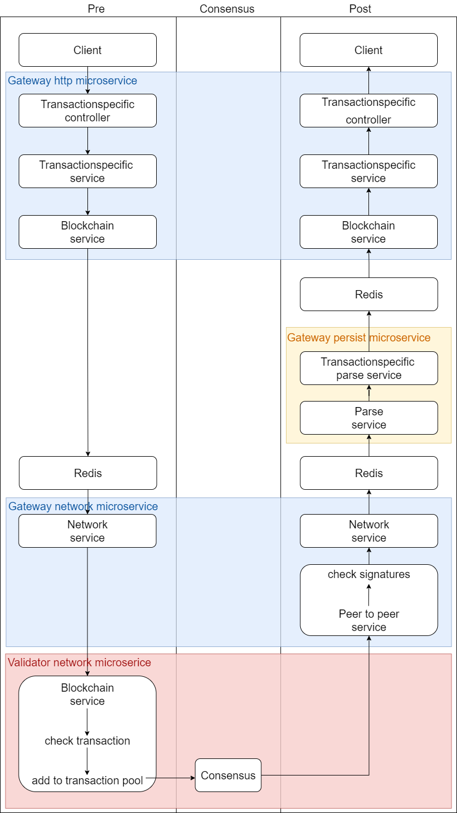

# Transactions
## Transaction flow
Every blockchain transaction has the same flow. 

## TransactionTypes
| Type | Category  | Description |
| ----------- | ----------- | ----------- |
| HashCreation | Done by clients | Transaction to create a claim. |
| HashRevocation | Done by clients | Transaction to revoke a claim. |
| SecurityLimit | Security Features | TODO |
| SecurityRecaptcha | Security Features | TODO |
| Did | DID | TODO |
| SchemaCreation | VC | TODO |
| ClaimDefinition | VC | TODO |
| RevocationRegistryCreation | VC | TODO |
| RevocationEntry | VC | TODO |
| Template | Template | TODO |

## Transaction pool
- The transaction pool is a collection of transactions that are requested to the network.
- The transaction pool is a decentralized component, meaning every node has its own transaction pool. It is not persisted, so if a node crashes, the transaction pool is lost. 
- There are only valid transactions in the pool so every node has to validate a transaction before putting it in the pool.
- The pool handles the transactions first in first out. <!-- TODO: check-->

## Validating transactions
The transaction object has following properties:

| Property | Type | Validations | Description |
| ----------- | ----------- | ----------- | ----------- |
| version! | number | IsNumber, IsPositive | Version number of the base transaction. |
| metadata! | TransactionMetadata* | (Type= TransactionsMetadata)| Appended meta data| 
| body! | TransactionBody** | (Type = TransactionBody)| Body of the transaction| 
| signature! | SignatureInfo*** | (Type == SignatureInfo) | Signature information to the value. | 
| block? | PersistedBlock | | Information on the persisted block | 

*The TransactionMetadata object has following properties:

| Property | Type | Validations | Description |
| ----------- | ----------- | ----------- | ----------- |
|version! | number | IsNumber, IsPositive |Version number of the base transaction.|
|Imported? | ImportedMetadata**** | Type == ImportedMetadata | If set the timestamp of the metadata is set as the created at timestamp. Required when data should be imported from another blockchain. |

**The TransactionBody object has following properties:

| Property | Type | Validations | Description |
| ----------- | ----------- | ----------- | ----------- |
| version! | number | IsNumber, IsPositive | Version number of the transaction type. |
| type! | TransactionType | | Type of the transaction |
| date! | string | IsRFC3339 | timestamp when transaction was created |
| value | any | | Body of a transaction. |

***The SignatureInfo object has following properties:

| Property | Type | Validations | Description |
| ----------- | ----------- | ----------- | ----------- |
| type! | SignatureType | enum: SignatureType | Type of the signature procedure. | 
| values! | SignatureDto[] | Type == SignatureDto, ValidateNested each:true | Date and signature of the value. | 

****The ImportedMetadata object has following properties:

| Property | Type | Validations | Description |
| ----------- | ----------- | ----------- | ----------- |
| date! | string | IsRFC3339 | timestamp when transaction was persisted in the old blockchain. | 
| imported! | SignatureInfo | Type == SignatureInfo, IsObject | If set the timestamp of the metadata is set as the ‘created at’ timestamp. Required when data should be imported from another blockchain | 

