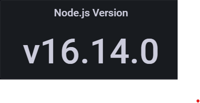

# Monitoring 

For monitoring the system you can use grafana. See [the configuration documentation](getting_started.md#Configuration) to see how to set up grafana.

## Existing dashboards

There are some existing dashboards in the grafana. They can be descriped as follows: 

### validator1 > Resources

